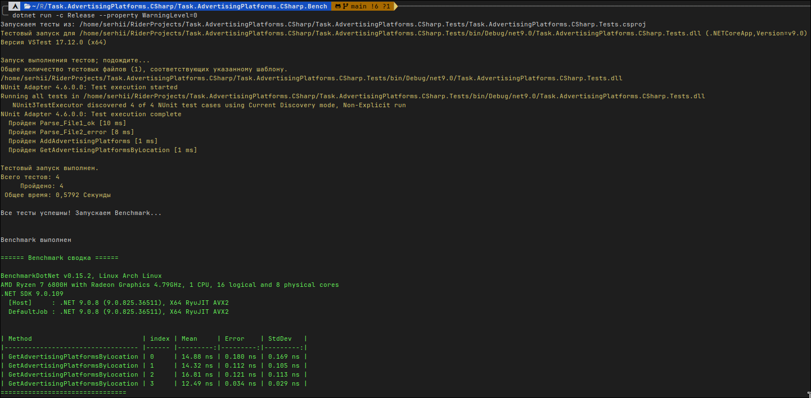

# Выполненное тестовое задание<br>Задача. Рекламные площадки. (C#)
## Инструкция по запуску веб-сервиса
1. Склонируйте репозиторий
2. Перейдите в папку проекта [Task.AdvertisingPlatforms.CSharp.Presentation](Task.AdvertisingPlatforms.CSharp.Presentation)
3. Запустите проект с помощью команды<br>
```bash
dotnet run
```
Сервис будет доступен на порту: http://localhost:5070<br>
Swagger работает по адресу: http://localhost:5070/swagger<br>
## Инструкция по использованию
Для проверки конечной точки http://localhost:5070/AdventPlatform/upload :<br>
В папке "TestFiles" есть 2 файла - [File1_ok](TestFiles/File1_ok) и [File2_error](TestFiles/File2_error)<br>
Первый файл содержит валидные данные, второй данные с ошибкой

# Инструкция по тестированию
1. Склонируйте репозиторий
2. Перейдите в папку проекта [Task.AdvertisingPlatforms.CSharp.Tests](Task.AdvertisingPlatforms.CSharp.Tests)
3. Запустите проект с помощью команды<br>
```bash
dotnet test
```

# Инструкция Benchmark
1. Склонируйте репозиторий
2. Перейдите в папку проекта [Task.AdvertisingPlatforms.CSharp.Bench.csproj](Task.AdvertisingPlatforms.CSharp.Bench.csproj)
3. Запустите проект с помощью команды<br>
```bash
dotnet run -c Release --property WarningLevel=0
```
Проект сначала проводит тесты [Task.AdvertisingPlatforms.CSharp.Tests](Task.AdvertisingPlatforms.CSharp.Tests), если тесты пройдены успешно, то запускается Benchmark
Пример результата Benchmark:
